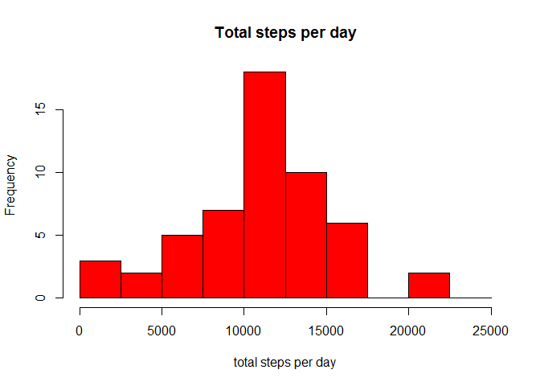
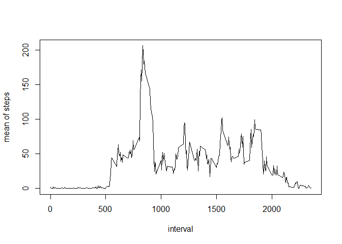
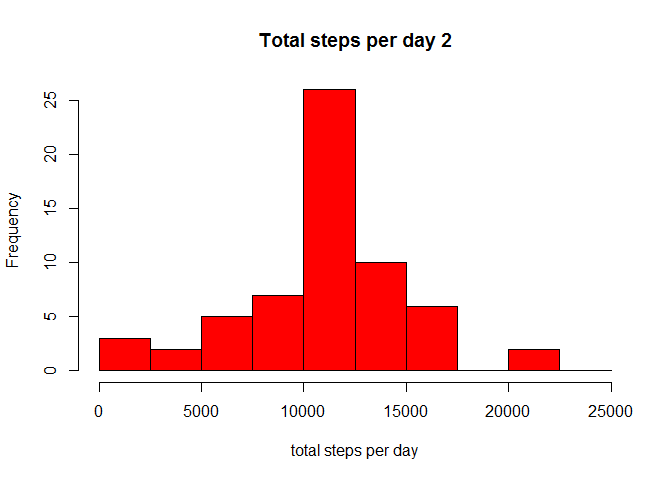

# PA1_template

This is an R Markdown document. Markdown is a simple formatting syntax for authoring HTML, PDF, and MS Word documents. For more details on using R Markdown see <http://rmarkdown.rstudio.com>.


```r
setwd('C:\\Users\\Lingqian\\Documents\\R\\reproducible\\RepData_PeerAssessment1\\')
```
1. Loading and preprocessing the data

```r
data=read.csv('activity.csv',header=TRUE,sep=',',na.strings='NA')
dim(data)
```

```
## [1] 17568     3
```

```r
head(data)
```

```
##   steps       date interval
## 1    NA 2012-10-01        0
## 2    NA 2012-10-01        5
## 3    NA 2012-10-01       10
## 4    NA 2012-10-01       15
## 5    NA 2012-10-01       20
## 6    NA 2012-10-01       25
```
2. Calculate the total number of steps taken per day

```r
total_daily=aggregate(data$steps,by=list(data$date),sum)
hist(total_daily[,2],main='Total steps per day',breaks=c(seq(0,25000,2500)),
     xlab='total steps per day',ylab='Frequency',col='Red')
```

 
3. Calculate and report the mean and median of the total number of steps taken per day

```r
mean_total_daily=mean(total_daily[,2],na.rm=TRUE)
mean_total_daily
```

```
## [1] 10766.19
```

```r
median_total_daily=median(total_daily[,2],na.rm=TRUE)
median_total_daily
```

```
## [1] 10765
```
4. average daily activity pattern?

```r
mean_interval=aggregate(data$steps,by=list(data$interval),mean,na.rm=TRUE)
head(mean_interval)
```

```
##   Group.1         x
## 1       0 1.7169811
## 2       5 0.3396226
## 3      10 0.1320755
## 4      15 0.1509434
## 5      20 0.0754717
## 6      25 2.0943396
```

```r
plot(mean_interval,type='l',xlab='interval',ylab='mean of steps')
```

 

```r
max_interval=mean_interval[,1][which.max(mean_interval[,2])]
max_interval
```

```
## [1] 835
```
5. total number of missing values in the dataset

```r
total_NA=nrow(data[is.na(data$steps),])
```
6. filling NA with mean of that interval

```r
colnames(mean_interval)=c('interval','mean_steps')
data2=data
data2$steps=ifelse(is.na(data2$steps),mean_interval$mean_steps[match(data2$interval,mean_interval$interval)],data2$steps)
```
7. new histogram of new data set without NA

```r
total_daily2=aggregate(data2$steps,by=list(data2$date),sum)
hist(total_daily2[,2],main='Total steps per day 2',breaks=c(seq(0,25000,2500)),
     xlab='total steps per day',ylab='Frequency',col='Red')
```

 

```r
mean_total_daily2=mean(total_daily2[,2],na.rm=TRUE)
mean_total_daily2
```

```
## [1] 10766.19
```

```r
median_total_daily2=median(total_daily2[,2],na.rm=TRUE)
median_total_daily2
```

```
## [1] 10766.19
```
no difference in the mean number of steps as the missing steps values filled with the average number of steps for that interval. 
median number of steps=mean number of daily steps

8. weekdays and weekends patterns

```r
data2$day=weekdays(as.Date(data2$date))
data2$day[which(data2$day=='Saturday')]<-'weekend'
data2$day[which(data2$day=='Sunday')]<-'weekend'
data2$day[which(data2$day!='weekend')]<-'weekday'
head(data2)
```

```
##       steps       date interval     day
## 1 1.7169811 2012-10-01        0 weekday
## 2 0.3396226 2012-10-01        5 weekday
## 3 0.1320755 2012-10-01       10 weekday
## 4 0.1509434 2012-10-01       15 weekday
## 5 0.0754717 2012-10-01       20 weekday
## 6 2.0943396 2012-10-01       25 weekday
```

```r
data3=aggregate(data2$steps,by=list(interval=data2$interval,day=data2$day),mean)
colnames(data3)[3]='steps'
library(lattice)
xyplot(data3$steps ~ data3$interval|data3$day, main="Average Steps per Day by Interval",xlab="Interval", ylab="Steps",layout=c(1,2), type="l")
```

 
